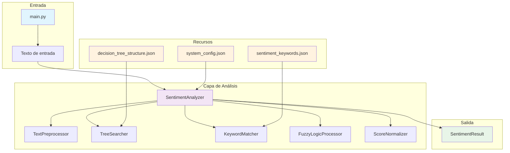
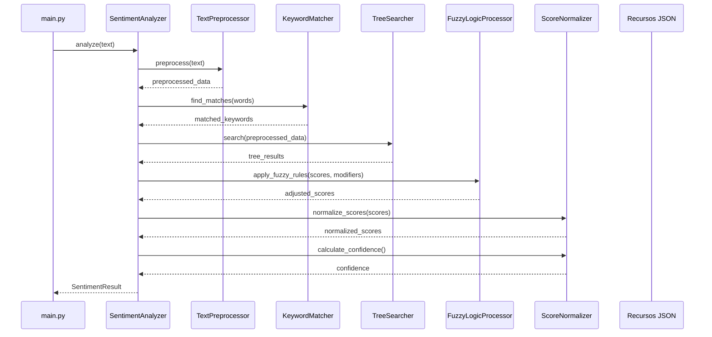
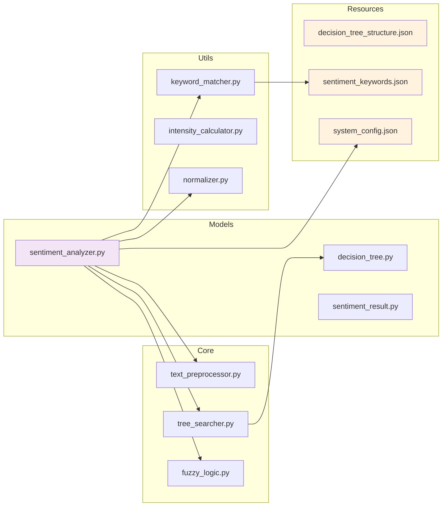
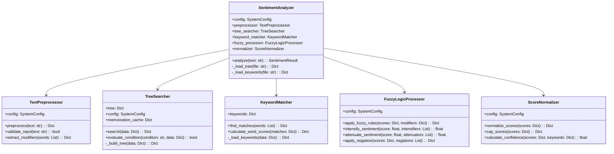
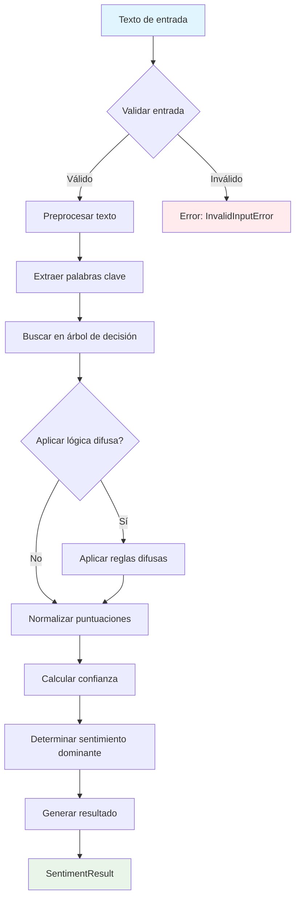
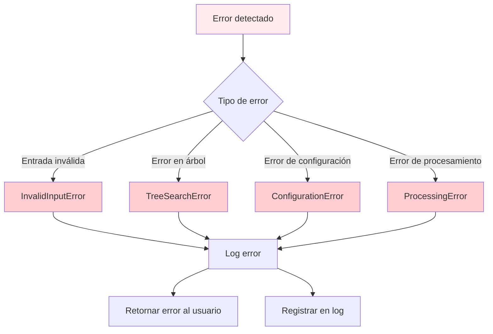
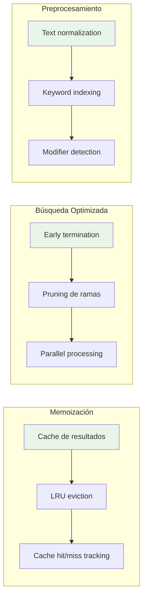
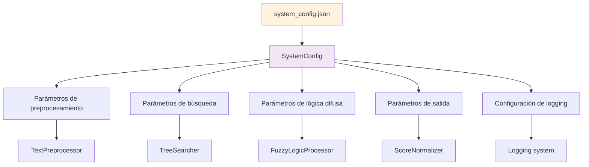
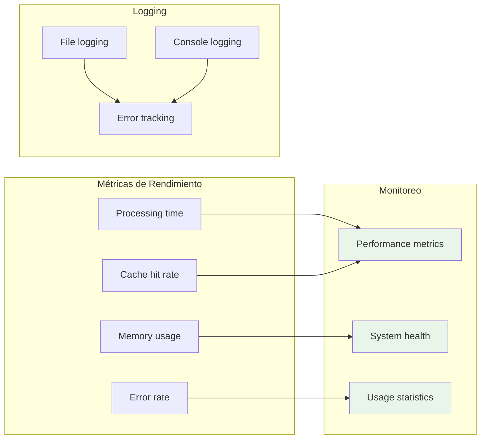

# Diagrama de Arquitectura del Sistema

## 1. Arquitectura General

## 2. Flujo de Datos Detallado

## 3. Estructura de Módulos

## 4. Jerarquía de Clases

## 5. Flujo de Procesamiento

## 6. Manejo de Errores

## 7. Optimizaciones

## 8. Configuración del Sistema

## 9. Métricas y Monitoreo

## 10. Resumen de Dependencias

| Módulo | Dependencias | Responsabilidad |
|--------|-------------|-----------------|
| `main.py` | `SentimentAnalyzer` | Punto de entrada |
| `SentimentAnalyzer` | Todos los módulos core | Orquestación del análisis |
| `TextPreprocessor` | `SystemConfig` | Preprocesamiento de texto |
| `TreeSearcher` | `SystemConfig`, `decision_tree_structure.json` | Búsqueda en árbol |
| `KeywordMatcher` | `sentiment_keywords.json` | Coincidencia de palabras |
| `FuzzyLogicProcessor` | `SystemConfig` | Aplicación de lógica difusa |
| `ScoreNormalizer` | `SystemConfig` | Normalización de puntuaciones |

## 11. Próximos Pasos de Implementación

1. **Crear estructura de directorios** según la arquitectura definida
2. **Implementar módulos core** siguiendo las interfaces especificadas
3. **Crear tests unitarios** para cada módulo
4. **Implementar integración** entre módulos
5. **Configurar logging y monitoreo**
6. **Optimizar rendimiento** con memoización
7. **Documentar API** y crear guías de uso 