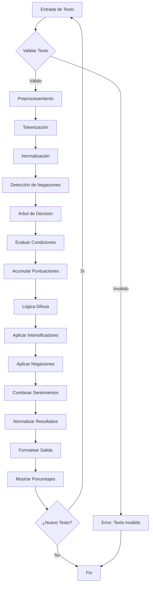
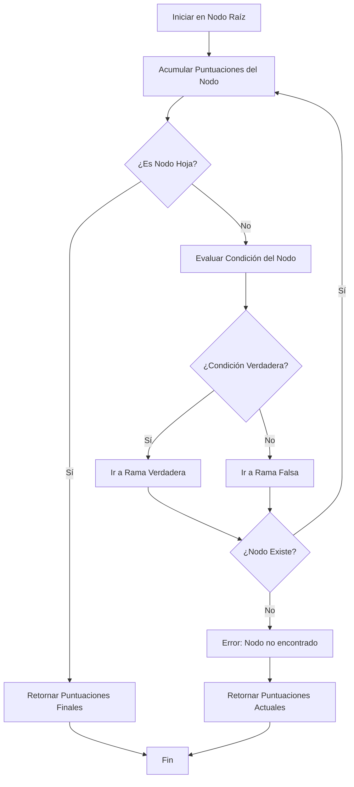
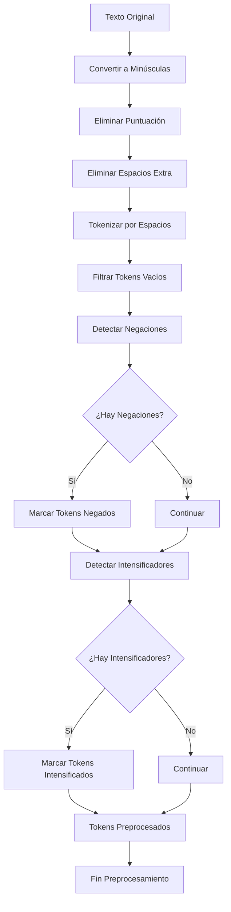
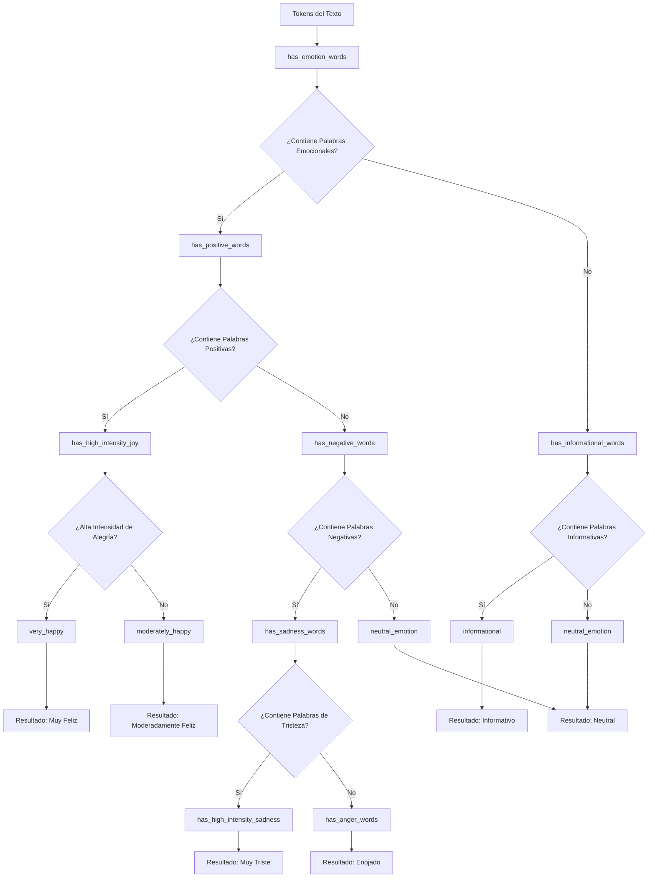
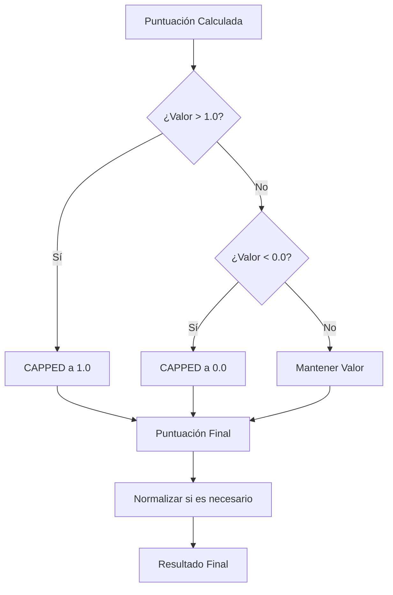
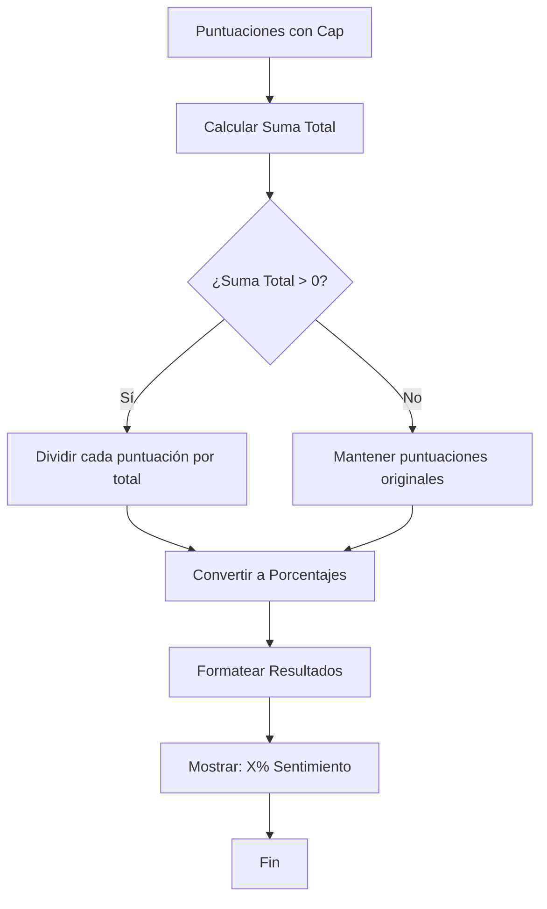
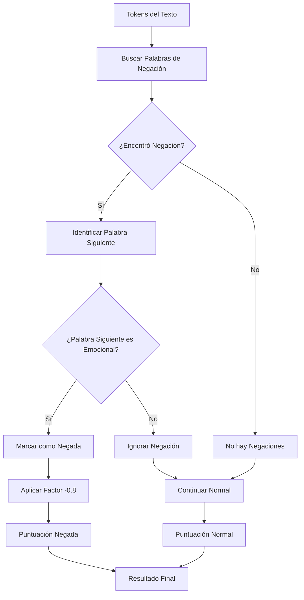
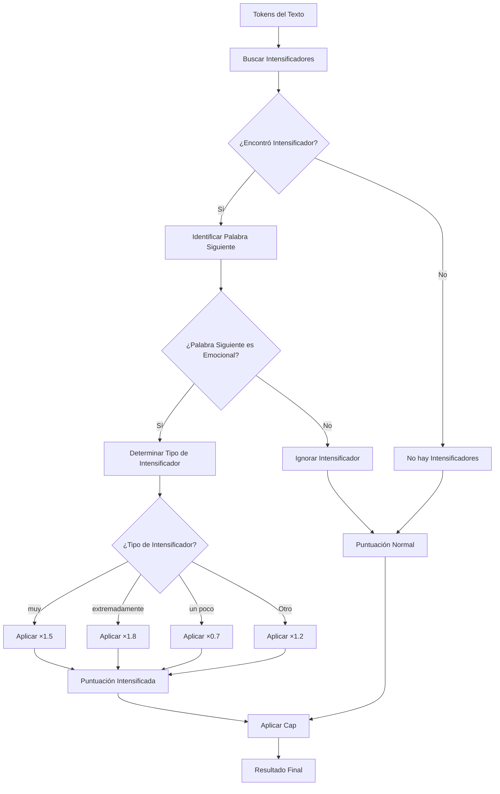
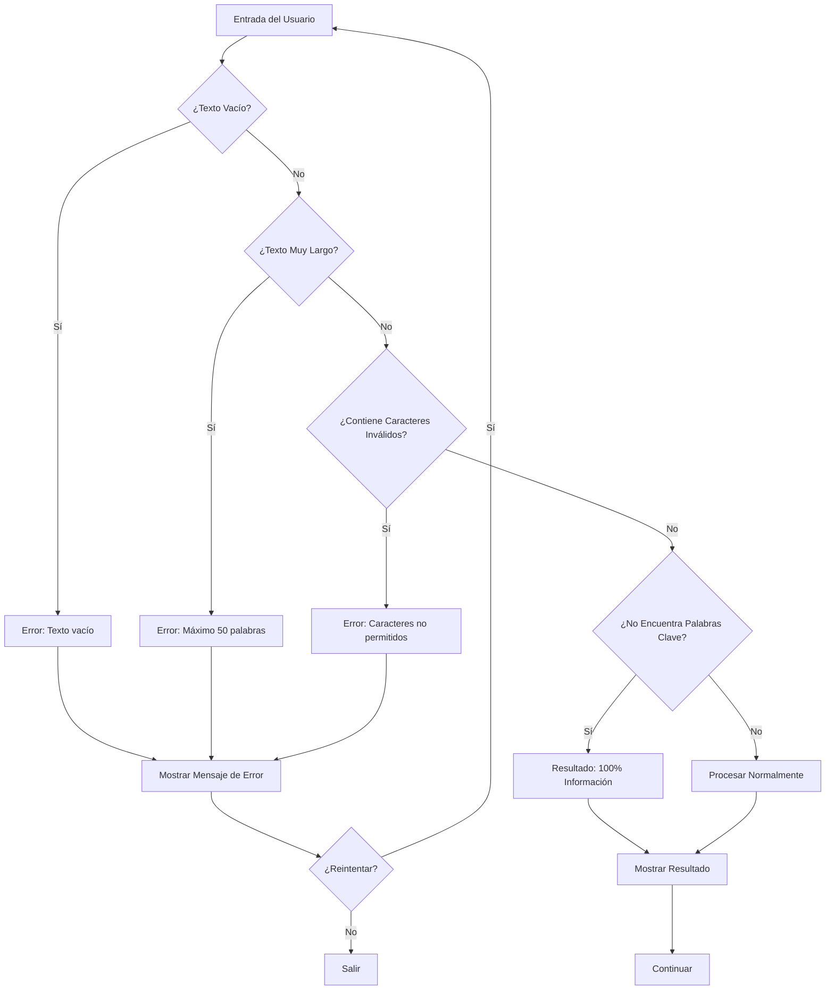
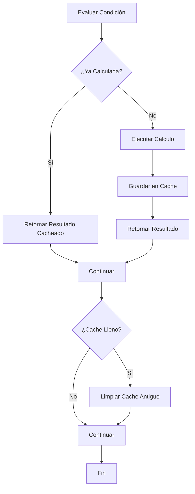

# Diagramas de Flujo del Sistema de Análisis de Sentimientos

## 1. Flujo Principal del Sistema



## 2. Algoritmo de Búsqueda en Árbol



## 3. Proceso de Preprocesamiento



## 4. Lógica Difusa - Aplicación de Reglas

```mermaid
flowchart TD
    A[Puntuaciones Base] --> B[Regla 1: Intensificadores]
    B --> C{¿Hay Intensificadores?}
  
    C -->|Sí| D[Aplicar ×1.5]
    C -->|No| E[Continuar]
  
    D --> F[Regla 2: Atenuadores]
    E --> F
  
    F --> G{¿Hay Atenuadores?}
    G -->|Sí| H[Aplicar ×0.7]
    G -->|No| I[Continuar]
  
    H --> J[Regla 3: Negaciones]
    I --> J
  
    J --> K{¿Hay Negaciones?}
    K -->|Sí| L[Aplicar ×(- 0.8)]
    K -->|No| M[Continuar]
  
    L --> N[Regla 4: Combinación]
    M --> N
  
    N --> O{¿Múltiples Sentimientos?}
    O -->|Sí| P[Aplicar Factor 0.8]
    O -->|No| Q[Continuar]
  
    P --> R[Aplicar Cap]
    Q --> R
  
    R --> S[Puntuaciones Finales]
```

## 5. Evaluación de Condiciones del Árbol



## 6. Cálculo de Puntuaciones con Cap



## 7. Flujo de Normalización



## 8. Detección de Negaciones



## 9. Aplicación de Intensificadores



## 10. Flujo Completo de Análisis

```mermaid
flowchart TD
    A[Usuario Ingresa Texto] --> B[Validar Longitud ≤ 50 palabras]
    B --> C{¿Texto Válido?}
  
    C -->|Sí| D[Preprocesar Texto]
    C -->|No| E[Error: Texto muy largo]
  
    D --> F[Cargar Árbol de Decisión]
    F --> G[Iniciar Búsqueda en Árbol]
  
    G --> H[Recorrer Nodos]
    H --> I[Evaluar Condiciones]
    I --> J[Acumular Puntuaciones]
  
    J --> K{¿Llegó a Nodo Hoja?}
    K -->|No| H
    K -->|Sí| L[Aplicar Lógica Difusa]
  
    L --> M[Detectar Modificadores]
    M --> N[Aplicar Reglas]
    N --> O[Normalizar Resultados]
  
    O --> P[Formatear Salida]
    P --> Q[Mostrar: "X% Alegría, Y% Tristeza..."]
  
    Q --> R{¿Analizar Otro Texto?}
    R -->|Sí| A
    R -->|No| S[Terminar Programa]
  
    E --> S
```

## 11. Manejo de Errores



## 12. Optimización con Memoización



---

## Notas sobre los Diagramas

### **Símbolos Utilizados:**

- **Rectángulos**: Procesos/Acciones
- **Diamantes**: Decisiones/Condiciones
- **Óvalos**: Inicio/Fin
- **Flechas**: Flujo de ejecución

### **Colores Sugeridos:**

- **Verde**: Procesos exitosos
- **Rojo**: Errores/Excepciones
- **Amarillo**: Decisiones
- **Azul**: Procesos normales

### **Ventajas de estos Diagramas:**

✅ **Claridad visual**: Fácil de entender el flujo
✅ **Documentación**: Ayuda a explicar el sistema
✅ **Debugging**: Facilita identificar problemas
✅ **Mantenimiento**: Fácil de actualizar y modificar

Estos diagramas proporcionan una visión completa del sistema de análisis de sentimientos, desde la entrada del texto hasta la generación de resultados finales.
